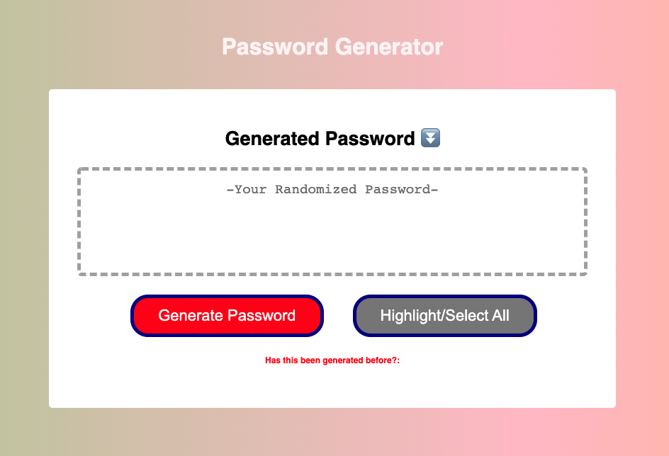
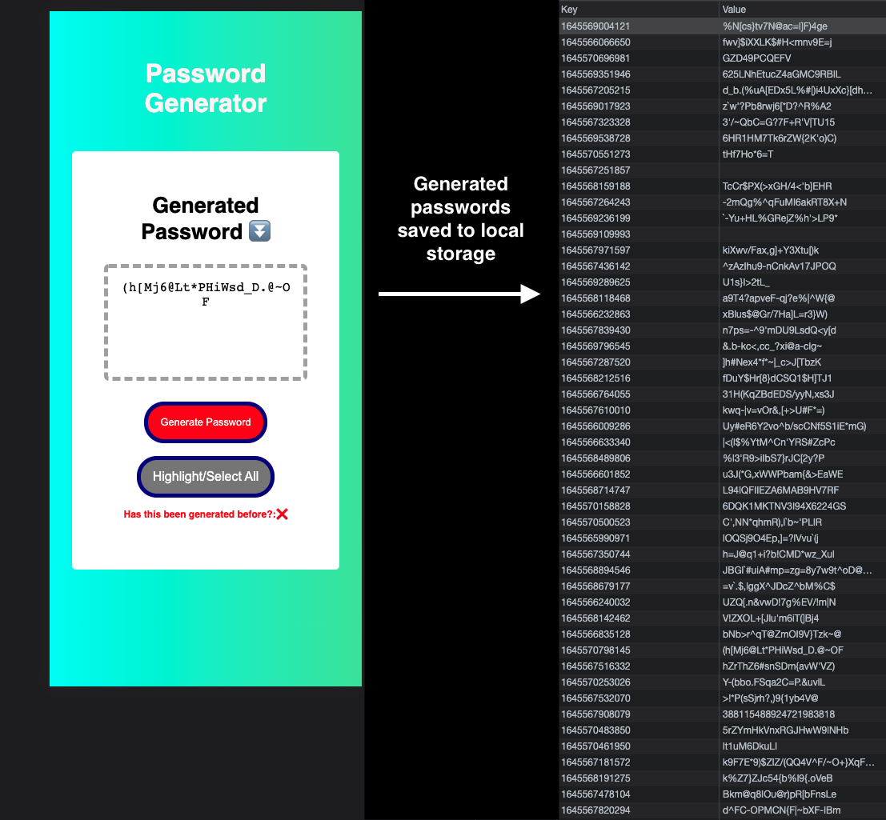

# PasswordGenerator
 A password generator that provides the user with prompts
 for password criteria. This allows for the user to create 
 a random password with between 8-128 characters, and a
 combination of potential lowercase characters, uppercase
 characters, numbers, and/or special characters. All
 generated passwords are saved to local storage, so the
 user will be notified via the statement at the bottom of
 the page, whether or not the password has been generated
 previously.
 
 Disclaimer(s): 
 - Passwords are saved to local storage, so
 previously generated passwords will not be available
 across devices, and potentially across browser updates
 - The use of generated passwords for sensitive information/
 accounts is not advised.
 

[Deployed Site](https://st12345678910.github.io/PasswordGenerator/)
 

